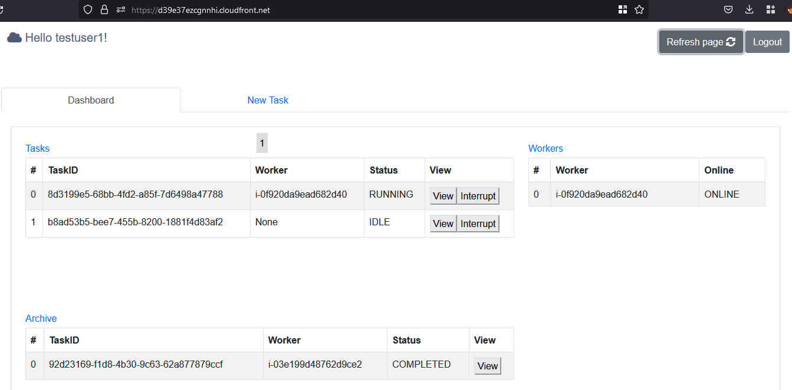
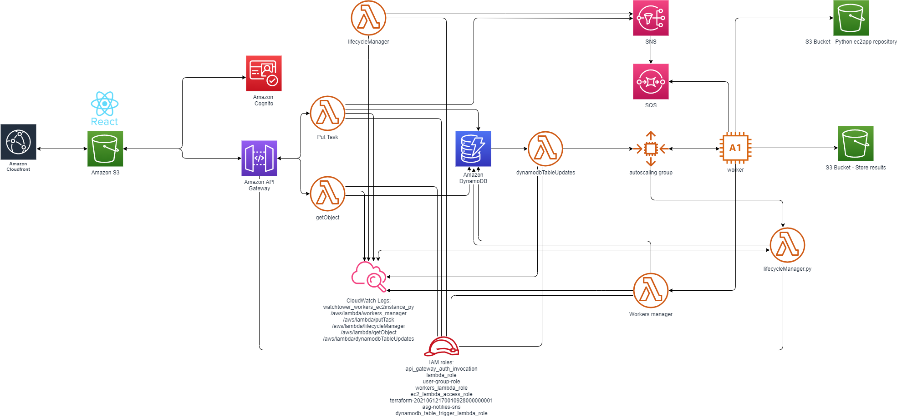
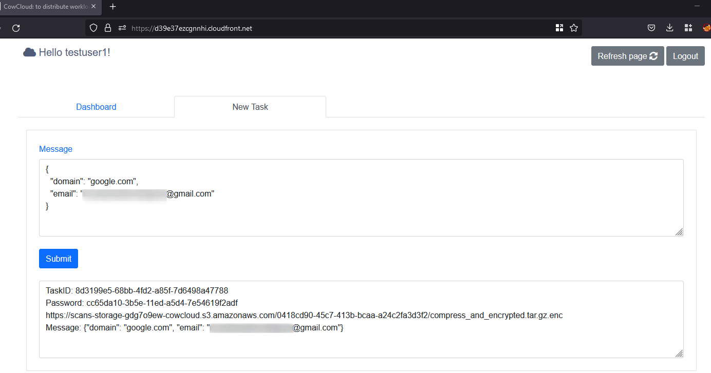

# CowCloud
### a serverless solution to distribute work-loads in AWS

CowCloud was originally created to run recon tools and vulnerability scans in a distributed way; for example, one use case might be by bug bounty hunters. This solution is intended to abstract end users from the underlying work required to distribute workloads in AWS. CowCloud provides users with a friendly web interface to view and create new tasks that later on are consumed by Python code running on worker nodes (EC2 instances). It is intended that the Python code will be customised as well as the EC2 AMIs.
As an example, let’s say you want to run Nmap scans. In that case, you can simply pick an AMI from the AMI Catalog and update the field `image_id` in `Terraform/ec2_module/ec2_module.tf`. Then, the file `ec2py/template.py` would have to be updated to customize the arguments for the Nmap scan (-Pn, -p 443, etc). Lastly, the `user_data` field in the `Terraform/ec2_module/ec2_module.tf` configuration file would have to be updated to install Nmap and its dependencies. 

Another option is to install and run several commercial tools, in that case, you might want to create your own EC2 instance or snapshot. In this case you would install all the dependencies and activate the licences so you could use this AMI as the gold image for your workers



CowCloud can be broken down into three main components:
- a Terraform configuration
- a React JS front-end
- a Python app that runs on worker nodes

These are the **key features:**

- The solution uses Amazon Cognito (with a user pool) so the users can sign up and sign in to the webapp
- React JS app as the front-end application. The front-end displays the tasks and workers and allows you to add new tasks
- API gateway with Lambda integration to handle the CORS and to interact with some of the Lambda functions to create and obtain information from the DynamoDB
- CloudFront for managing SSL and cache
- WAF with rules and IP address conditions to restrict access to the webapp (this is optional)
- S3 buckets to store the execution results and the front-end app; a separate S3 bucket is used as a code repository for the Python app.
- A Python app as the core for running tasks on the EC2 instances (workers), the tool actions can be broken down into a number of steps:
	- The Python app consumes messages
	- runs scans
	- compresses the output
	- and encrypts the output with AES256-CBC and a password
	- then uploads the result to an S3 bucket
- Every time a new worker is created, the Python repository is pulled  from an S3 bucket and then the ec2py file included in it is executed.
- Every time a new worker is created, an EIP could be automatically assigned to the instance (this is optional)
- CloudWatch logging groups to store the logs from various sources such as Lambda errors, exceptions happening on the ec2app Python tool, the API Gateway, Docker logs and much more
- Lifecycle hooks to change the workers status on DynamoDB and prevent workers being terminated while a task is still running
- Autoscaling strategy based on the number of queued tasks and the configuration set (further information about how the algorithm works can be found in `autoscalingStrategy.py`)
- Lambda event source mapping linked for the task table in DynamoDB, this is to manage the autoscaling actions when the items in the database increase or decrease
- SNS to send new messages (tasks) into an SQS, these messages are later read by the worker nodes
- Step functions service is used to create a countdown and delete the CloudWatch logging groups after `retention_time` expires
- If ec2py runs tools (e.g. Nmap) inside Docker containers, the stdout can be logged into Cloudwatch and viewed through the front-end; check out the variable `extra_docker_params` in the `template.py` file (this is explained in the Administrator/maintainer section below)
- The front-end provides a button for tasks to be interrupted during their execution and another button to view the Docker container logs
- If you want to change anything in the front-end code or in the ec2py folders, then you'll need to propagate those changes to the S3 buckets and invalidate the cache for the front-end; you can do all that by simply executing the setup.bat/sh


### Diagram:


### The following options are available within the Terraform configuration:

|variable|default value|description|
|---|---|---|
|`eipenable`|false|If true, the solution allocates a pool of elastic IP addresses associated with the worker nodes as they are spun up. The number of EIP to reserve is worked out using this formula`sum([var.max_workers, var.maximum_number_of_terminating_machines])`|
|`cidr_whitelist`|[]|The CIDR whitelist to allow only certain IP ranges in the firewall. E.g. ["195.95.131.0/24"]|
|`max_workers` and `max_queued_tasks_per_worker`|`max_workers`: 3, `max_queued_tasks_per_worker`: 10|These two settings determine when to scale in or scale out, e.g. max_workers 3, max_queued_tasks_per_worker 10. This means if the number of tasks overpasses ten, a new EC2 instance will be created. If there are more than twenty tasks, a maximum of three EC2 instances will be available to distribute the workloads (check out algorithm present in this script `Terraform/dynamodb_module/autoscalingTool/autoscalingStrategy.py`).|
|`maximum_number_of_terminating_machines`|2|This defines the number of instances that are set to terminate but are on hold until the process/scan completes the task.|
|`heartbeat_timeout`|900|This defines the time that those workers are on hold. After this time expires, the worker will be forcibly terminated.|
|`instance_type`|t2.micro|https://aws.amazon.com/ec2/instance-types/|
|`ami`|null|https://aws.amazon.com/es/amazon-linux-ami/|
|`retention_time`|7|Set the retention time (days) for logs and the expiration of the archive table items (completed tasks).|


As a result of executing the Terraform, a new file is created (config.js);, this contains the configuration required for the React JS app to authenticate against the Cognito user pool directory. After the infrastructure has been deployed, you have to build the React app and upload the folder build. In addition, you have to upload the Python code to an S3 bucket that acts as a code repository. This process has been automated in two scripts `setup.bat` and `setup.sh` so you don't have to worry about this, this is just to summarize this stage.

---

### Installation steps:

The infrastructure is deployed in the `us-east-1` region by default, although this can be changed in the `locals.tf` file within the Terraform folder.

**Steps:**
- You should create a user with admin privileges within your AWS account
- (Optional) Create a ‘golden’ AMI with the tools you want
- Go to the Terraform folder and update the `variables.tf`; the `ami` variable has to point to an existing EC2 AMI, which could be your golden AMI or one from the EC2 Catalog
- Download and install aws-cli, NPM, Yarn and Terraform in your computer
- Configure aws-cli to use your AWS account in `aws configure`. Check you have configured it properly by running this command: `aws sts get-caller-identity`; when correctly configured this should not return an error
- (Optional) Generate an SSH key pair for the EC2 instances. If you don’t plan to SSH the workers, then update the module ec2_module accordingly
`aws ec2 create-key-pair –key-name cowCloud –query “cowCloud” –output text > ec2_module/cowCloud.pem`


```sh
git clone git@github.com:nccgroup/cowcloud.git
# Deploy the infra
cd cowcloud
cd Terraform
terraform init
terraform plan
terraform apply --auto-approve
```
- Take note of the value (website) displayed in the Terraform output, this is the URL to access the front-end
- Once the infrastructure has been deployed, you just need to run either setup.sh or setup.bat to build and upload the front-end and ec2py code

Now you are ready to go! Sign up, sign in and create a new task! 

### End-user flow
**Once everything is deployed and the front-end is accessible, you should follow these steps:**
- Visit the website and click on the sign in button
(to sign up you will be required to submit a valid email, username and password)
- Validate the email by clicking on the link you receive in your email inbox
- Sign in with the email/username and password
- Click on the tab called “add a new task” and update the JSON document to specify the target domain and submit the form; you will now receive a task ID, a link and a password that are going to be displayed below.
- Go back to the dashboard and wait to see how a new EC2 instance is spun up and the task is executed by the worker node
- If the task is executed in  a Docker container, the stdout can be viewed through the web interface
- After the task is completed, the task is moved to the archive table; you can now visit the given link, download the result, decrypt it with the given password and decompress the tool output or result `CowCloud\ec2py> python .\decypt_file.py 2e8cf87c-5389-11ec-abec-d6d1f378b18d`
- The worker is automatically terminated once the task has been completed




### Administrator/maintainer
* The person in charge of deploying the infrastructure and maintaining it has to properly sanitise and validate the end-user inputs supplied through the web app. In other words, ensure that the code in `ec2py/template.py` is not vulnerable to OS command injection. 
This point is highlighted as this is the most critical aspect of the system. Special care has been taken to limit the scope of the worker’s permissions and exposure and so reduce the associated risks. Nevertheless, it is the admin’s responsibility to take care of this aspect of system security. 
__The role policies attached to the EC2 instances profile are listed in the readme.md file inside the Terraform folder__
	* In addition, there is a Lambda function called `workers_manager.py` that is called by the ec2py tool to perform more privileged actions. These actions were moved to a Lambda function to limit the risk in the event that someone compromised the access key of the role attached to the EC2 profile. It works with IMDSv2 nonetheless.
	__The role policies attached to the Lambda function `workers_manager.py` are listed in the readme.md file inside the Terraform folder__
* If you want to capture the stdout and show it through the web interface while the tasks is being executed, then go to the `ec2py/template.py` and follow these steps::
	- The `extra_docker_params` variable includes the information required for your Docker containers to send the stdout to CloudWatch log groups. You will need to include this variable in the command line when you want to view the stdout through the front-end.
	
	```sh
	cmd = f"docker run {extra_docker_params} --rm -v {tmp_folder}target.txt:/root/Tools/reconftw/target.txt -v {tmp_folder}reconftw.cfg:/root/Tools/reconftw/reconftw.cfg -v {tmp_folder}Recon/:/root/Tools/reconftw/Recon/ six2dez/reconftw:main -l target.txt -w".split(' ')
	```

### Uninstall

You can destroy the infrastructure by running this simple command: `terraform destroy --auto-approve` this will remove all the existing resources.
**Note:** don't interrupt this process as this could leave some elements lingering in the cloud which you would then have to identify and remove manually.

---

### End-user flow

### Core flow


---

### Dev notes
- If you make a change in the ec2py app remember to sync the changes with the S3 repo; you must then terminate the current instances and relaunch a new one to pull in the latest changes
- When a component from the gateway module is changed, you might need to redeploy the REST APi, to do so:
	- `terraform destroy --auto-approve -target module.gateway_module.aws_api_gateway_deployment.lambda`
	- `terraform apply --auto-approve -target module.gateway_module`


### Special thanks to:
- Sabrina MM https://www.linkedin.com/in/sabrina-marisol-martinez-a4bb54181/
- Ricardo Martinez Martin (NCC Group)
- Conor McErlane (NCC Group)
- Simon Harraghy (NCC Group)
